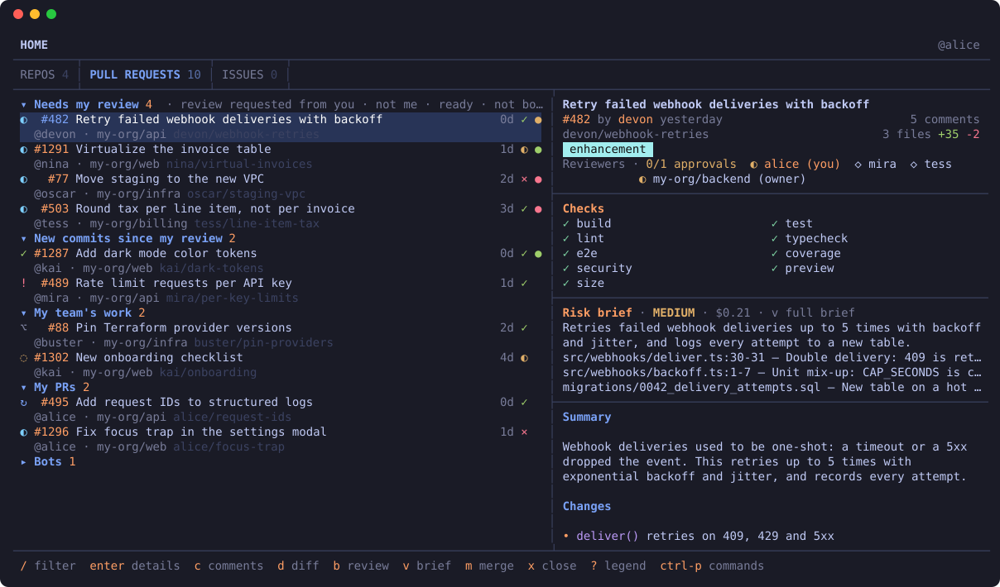
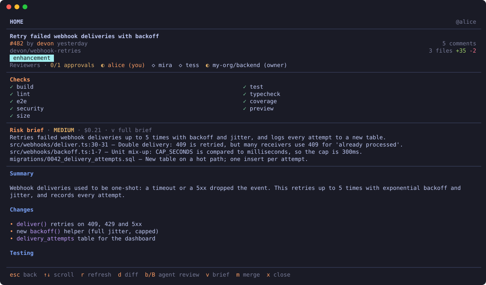
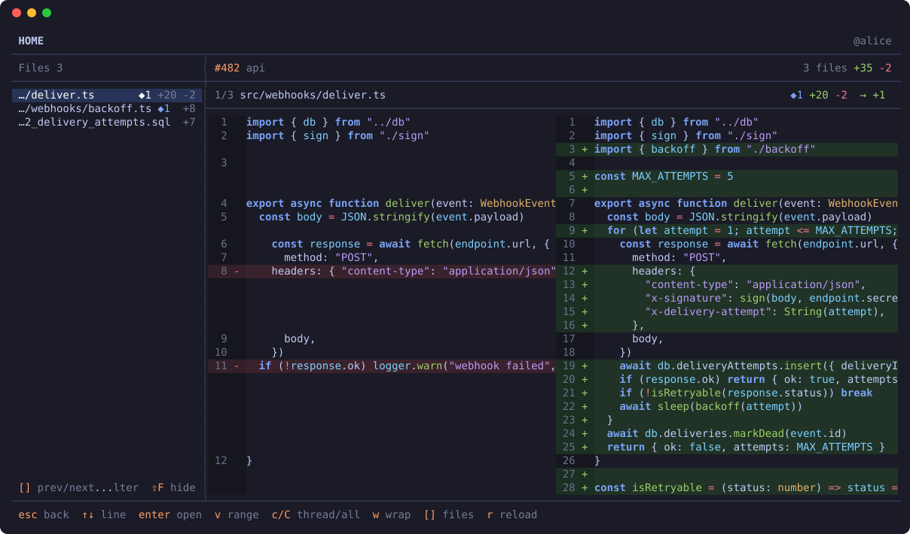
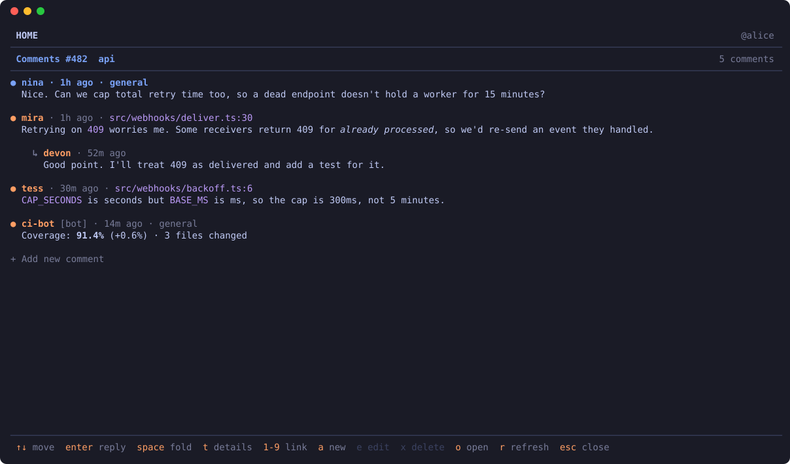
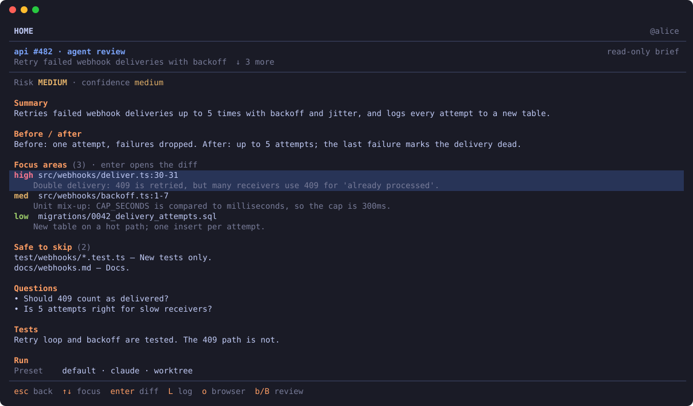
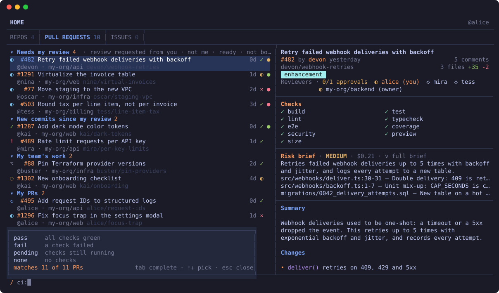
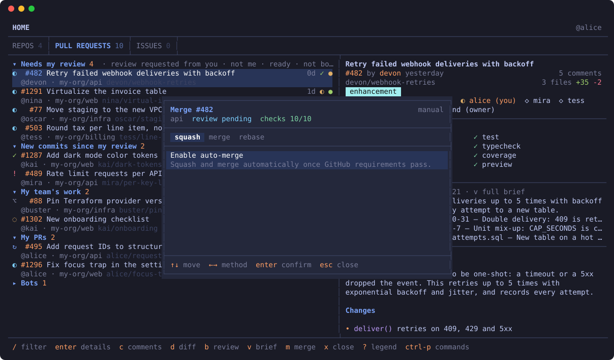
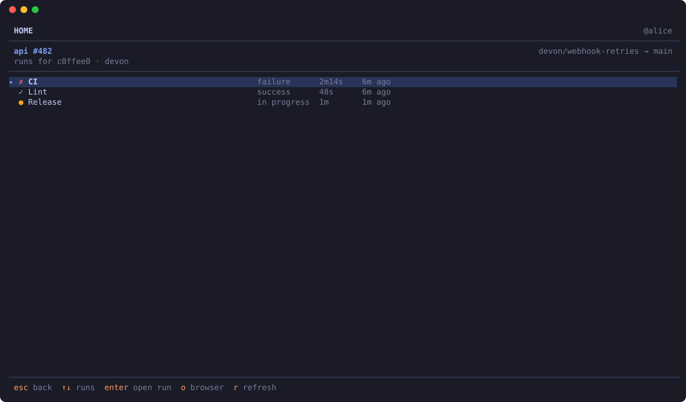
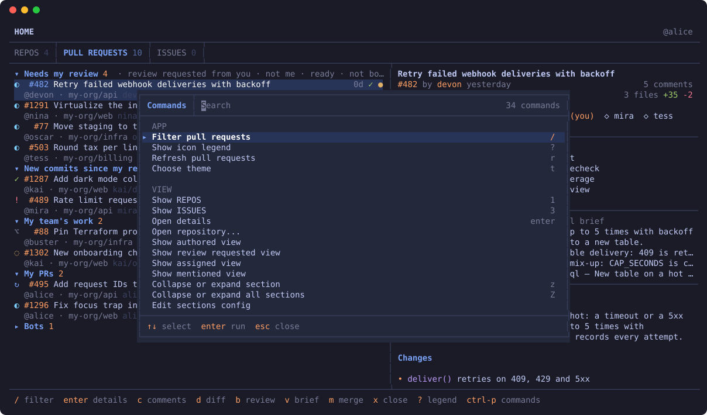

# prs

PR review in your terminal. Your agent reads the PR first and tells you where to look.



## Install

Needs [Bun](https://bun.sh), Node, git, and the [GitHub CLI](https://cli.github.com) (`gh auth login` if you haven't).

```bash
curl -fsSL https://raw.githubusercontent.com/mct-dev/prs/main/install.sh | bash
```

Clones to `~/.local/share/prs` and puts `prs` in `~/.bun/bin`. Run it again to update, or `prs upgrade`.

By hand:

```bash
git clone https://github.com/mct-dev/prs.git
cd prs
bun install
bun link        # puts `prs` on your PATH (~/.bun/bin)
```

Update: `git pull && bun install` in the checkout.

Agent review (optional) needs [Claude Code](https://claude.com/claude-code) or [Codex](https://github.com/openai/codex) on your PATH.

## Use

It opens on your sections: needs my review, new commits since my review, my team, mine, bots.

| Key | |
|---|---|
| `j` / `k` | move |
| `[` / `]` | prev / next section |
| `enter` | details |
| `d` | diff |
| `c` | comments |
| `b` | agent review |
| `v` | open the brief |
| `/` | filter |
| `shift-r` | review / approve |
| `m` | merge / auto-merge |
| `x` | close |
| `o` | open in browser |
| `?` | what the icons mean |
| `ctrl-p` | everything else |
| `q` | quit |

## Filter

`/` then type. `tab` completes.

```
org:my-org ci:pass -review:approved idle>3d
author:alice size>400
risk:high brief:done
```

## Sections

Edit with `ctrl-p` → **Edit sections config** (`~/.config/prs/sections.yaml`). **Choose my teams** sets your team.

## Agent review

`b` runs your agent on the PR and writes a risk brief: what changed, where to look, what's safe to skip. `B` picks or edits presets.

It's read-only. It can't comment, approve, or push.

## Views

Details (`enter`)


Diff (`d`)


Comments (`c`)


Agent brief (`v`)


Filter (`/`)


Merge (`m`)


Workflow runs (`a`)


Commands (`ctrl-p`)


Mock data. Regenerate with `bun run screenshots`.

## More

Config, filters, keys: [docs/reference.md](docs/reference.md).

## Credits

Fork of [ghui](https://github.com/kitlangton/ghui) by Kit Langton. MIT.
